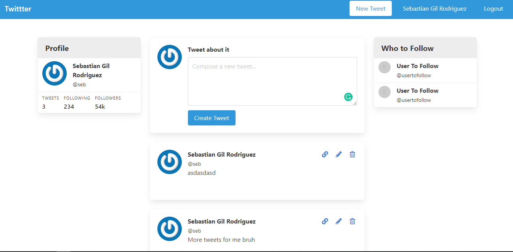

# Twitter Clone

> This is a simple twitter clone built in Rails. It has authentication and tweet ownership.

## Features

- Publish, edit and delete Tweets.
- Sign up, edit and delete user profiles.

## Built With

- Ruby 2.7.0
- Rails 6.0.2.2

Gems:
- Simple Form
- Devise
- Gravatar
- Bulma

## Authors

👤 **Sebastian Gil Rodriguez**

- Github: [@sebGilR](https://github.com/sebGilR)
- Twitter: [@sebGilR](https://twitter.com/sebGilR)
- Linkedin: [sebastiangilrodriguez](https://www.linkedin.com/in/sebastiangilrodriguez)

## 🤝 Contributing

Contributions, issues and feature requests are welcome!

Feel free to check the [issues page](https://github.com/sebGilR/blogger_rails/issues).

## Show your support

Give a ⭐️ if you like this project!
